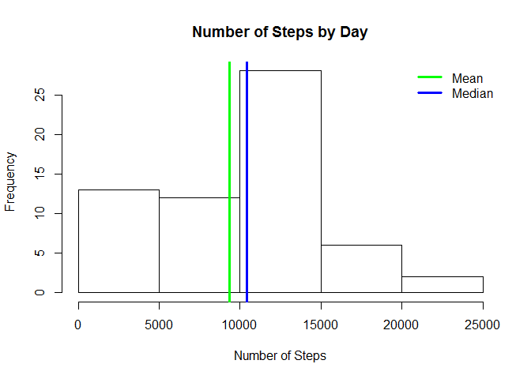
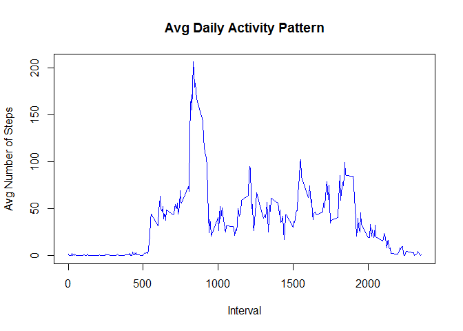
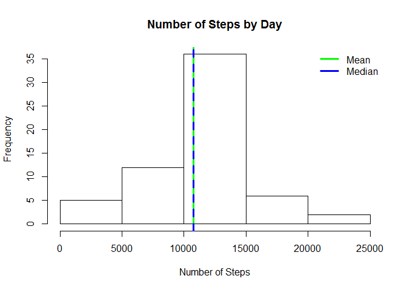
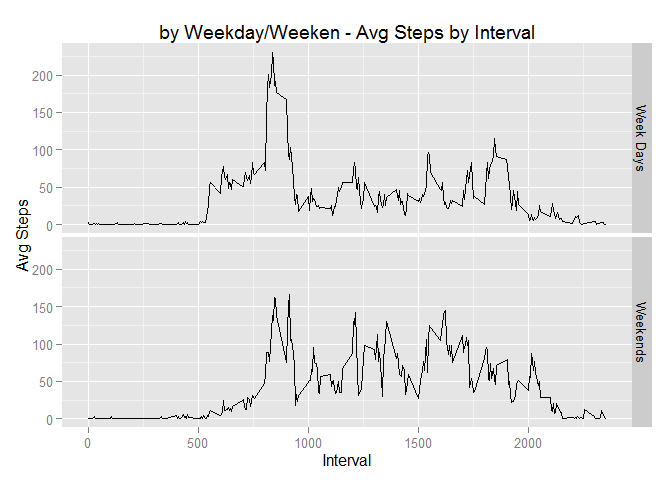

# Reproducible Research: Peer Assessment 1


## Loading and preprocessing the data


```r
#Set Working Directory
setwd("F:/PK/Coursera - Data Science Specialization/Course 5 - Reproducible Research/Week 2/RepData_PeerAssessment1")

#Read CSV - Variales not as Factors
activity <- read.csv("activity.csv",stringsAsFactors = FALSE)

#Data Processing

activity$steps <- as.numeric(activity$steps) #Transform Steps into Numeric
activity$date <- as.Date(activity$date) #Transform Date into Date
activity$interval <- as.numeric(activity$interval) #Transform Interval into Numeric
```

## What is mean total number of steps taken per day?


```r
#Total Steps by Date
#Instruction was that we MAY ignore Missing values
#Missings have not been considered here

sum_steps_byday <- tapply(activity$steps,activity$date, sum, na.rm=TRUE)
  
mean_steps_byday <- mean(sum_steps_byday, na.rm=TRUE) #Mean of Steps by Day
median_steps_byday <- median(sum_steps_byday, na.rm=TRUE) #Median of Steps by Day

#Historgram of Total Steps by Date
hist(sum_steps_byday,
     xlab = "Number of Steps",
     main = "Number of Steps by Day") 

abline(v=mean_steps_byday,
       col='green',
       lwd=3)

abline(v=median_steps_byday,
       col='blue',
       lwd=3)

legend(x="topright", 
       legend=c("Mean","Median"), 
       col=c("green","blue"), 
       bty="n", 
       lwd=3)
```

 

###Mean and Median of Tot Steps


```r
#Mean
mean_steps_byday
```

```
## [1] 9354.23
```

```r
#Median
median_steps_byday
```

```
## [1] 10395
```

## What is the average daily activity pattern?


```r
#Calculate Avg Steps by Interval
mean_steps_byInt <- tapply(activity$steps,activity$interval, mean, na.rm=TRUE) #Mean of Steps by Interval


#Time-Series Plot of Avg Daily Activity by Interval
plot(names(mean_steps_byInt),
     mean_steps_byInt,
     type = 'l',
     main = "Avg Daily Activity Pattern",
     xlab = "Interval",
     ylab = "Avg Number of Steps",
     col = "blue",
     bg = "transparent"
     )
```

 

###Interval with Max Number of Steps


```r
#Interval with Max Number of Steps
names(which.max(mean_steps_byInt))
```

```
## [1] "835"
```

## Imputing missing values


```r
#Number of Observations with NA Cases
sum(is.na(activity))
```

```
## [1] 2304
```

```r
#Mean of Steps by Interval
mean_steps_byInt <- tapply(activity$steps,activity$interval, mean, na.rm=TRUE)

#New Dataset where Missing Values of Steps replaced by Mean of Steps by Interval
activitynew <- transform(activity, steps=ifelse(is.na(steps), mean_steps_byInt, steps))

#Total Steps by Date
sum_steps_byday1 <- tapply(activitynew$steps,activitynew$date, sum, na.rm=TRUE)

mean_steps_byday1 <- mean(sum_steps_byday1, na.rm=TRUE) #Mean of Steps by Day
median_steps_byday1 <- median(sum_steps_byday1, na.rm=TRUE) #Median of Steps by Day

#Historgram of Total Steps by Date
hist(sum_steps_byday1,
     xlab = "Number of Steps",
     main = "Number of Steps by Day") 

abline(v=mean_steps_byday1,
       col='green',
       lwd=3)

abline(v=median_steps_byday1,
       col='blue',
       lwd=3,
       lty=2)

legend(x="topright", 
       legend=c("Mean","Median"), 
       col=c("green","blue"), 
       bty="n", 
       lwd=3)
```

 
       
###Mean and Median are higher than  before. Mean and Median coincide after Missing Imputation. 


## Are there differences in activity patterns between weekdays and weekends?


```r
#New Variable based on Day of Week: Weekday or Weekend

activitynew$WDcatg <- factor(weekdays(activitynew$date) %in% c("Saturday","Sunday"), labels=c("Week Days","Weekends"), ordered=FALSE)
avgstep_byint_bywkdctg <- aggregate(activitynew$steps, by=list(interval=activitynew$interval, WDcatg=activitynew$WDcatg), mean)

#Plot Avg Steps by Interval - 2 Panels for Weekdays and Weekends

library(ggplot2)
g <- ggplot(data=avgstep_byint_bywkdctg,
            aes(x=interval,y=x)) + geom_line() + facet_grid(WDcatg~.) + labs(x='Interval',y='Avg Steps',title= 'by Weekday/Weeken - Avg Steps by Interval')
g
```

 

###Morning activity is higher during Weekdays but overall activity is higher during Weekends.
